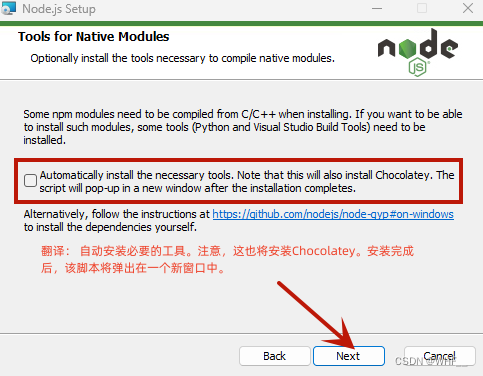
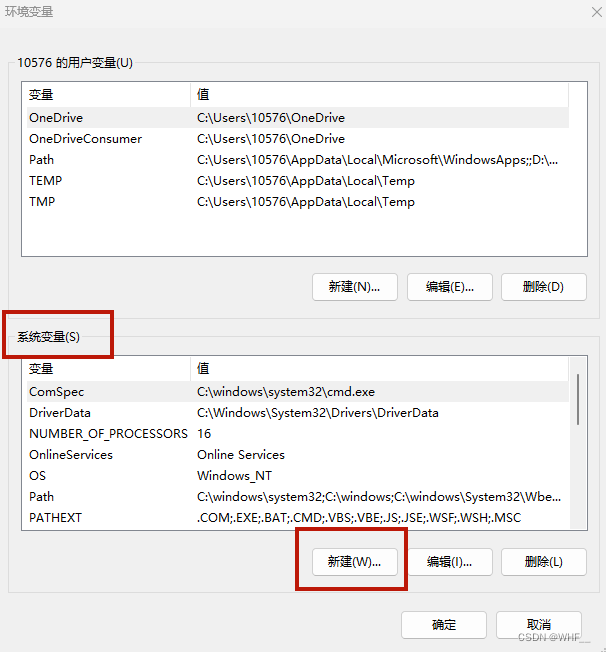
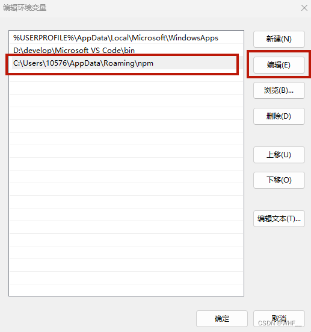
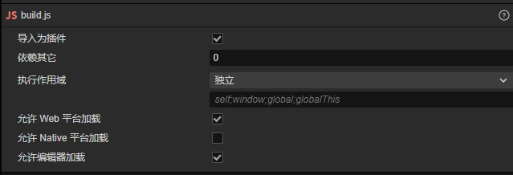

# Help_01 开发环境配置
---
| Date | Author | Content |
| :-----: | :--: | :------- |
| 2024/5/10 | 圆圈 | 创建文档 |
| 2024/5/12 | 圆圈 | 增加Server部署流程 |
## 1. 文档编辑器
### 1.1：Notable
- **Url**: [官网](https://notable.app)
- **Download**：<font color=#8FBC8F>夸克云文件/Package/Develop/Notable.rar</font>
- **Document**: [Markdown官方](https://markdown.com.cn/basic-syntax)
- **Version**: [Free]1.8.4

### 1.2: Visual Studio Code
- **插件**: Markdown Preview Enhanced
插件设置中勾选Always show backlinks in preview 和 Automatically show preview of markdown being eited


## 2. 客户端
### 2.1引擎：Cocos Creator
- **Url**: [官网](https://www.cocos.com/creator)
- **Cocos Dashboard Version**: [Free]2.1.3
- **Cocos Creator Version**: 3.8.2
- **Document**: [官网文档](https://docs.cocos.com/creator/manual/zh)
- **API**: [官方API](https://docs.cocos.com/creator/api/zh/)

### 2.2 客户端底层框架：Notable
- **Download**: <font color=#8FBC8F>Cocos商店</font>

## 3. 服务端
### 3.1 引擎：Node.JS
- **Url**: [官网](https://nodejs.org/en)
- **NodeVersion**: v18.19.0
- **npmVersion**: 10.2.3
- **Install**: 
***[Step1]*** Download: [Node.js中文网](https://www.nodejs.com.cn/download.html)进行下载和安装
Tips：如果想下载指定版本，点击【以往的版本】

```
//说明：
Node.js runtime 		表示运行环境
npm package manager	表示npm包管理器
online documentation shortcuts 	在线文档快捷方式
Add to PATH			添加到环境变量
```

不选中，直接点击【Next】
***[Step2]*** 安装完成后，打开cmd输入如下指令，成功显示版本号说明安装成功
Tips：新版本的Node.js在安装时已经集成好了npm，老版本的node.js需要单独安装npm（npm的作用是对Node.js依赖的包进行管理）
```
//查看Node.js版本
node -v
//查看npm版本
npm -v
```
***[Step3]*** 修改全局模块安装路径及cache路径
在Node.js的安装目录新建两个文件夹【node_global】【node_cache】

以**管理员身份**运行cmd，输入以下2行指令，把绝对路径改成自己Node.js的安装路径
```
npm config set prefix "D:\develop\Node.js\node_global"
npm config set cache "D:\develop\Node.js\node_cache"
```
***[Step4]*** 修改环境变量

在【系统变量】中点击【新建】
变量名：NODE_PATH
变量值：D:\develop\Node.js\node_global\node_modules
保存变量后检查node_global中是否自动创建了node_modules，如果没有手动创建一个

修改【用户变量】中的【Path】，把默认的 C 盘下【 AppData\Roaming\npm 】修改成 【node_global】路径

修改【系统变量】中的【Path】，增加%NODE_PATH%

完成后在cmd输入以下命令，全局安装一个最常用的 express 模块进行测试，如上图即为成功
`npm install -g express  // -g代表全局安装`
***[Step5]*** 安装淘宝镜像源
cmd输入如下命令修改npm源
`npm config set registry https://registry.npmmirror.com/`

淘宝最新npm镜像源为`registry.npmmirror.com`，旧域名HTTPS证书已到期，不可再使用，若配置了错误的镜像源，可使用如下命令进行修改
清理缓存
`npm cache clean --force`
修改镜像配置
`npm config set registry https://registry.npmmirror.com/`
可选源
```
//官方源：在国外，速度慢
https://registry.npmjs.org/
//淘宝：国内最常用的镜像源，推荐
https://registry.npmmirror.com/
//阿里云
https://npm.aliyun.com/
//腾讯云
http://mirrors.cloud.tencent.com/npm/
//华为云
https://mirrors.huaweicloud.com/repository/npm/
```

输入如下命令查看npm源，是否替换成功
`npm config get registry`
***[Step6]*** 安装cnpm
安装命令
`npm install -g cnpm --registry=https://registry.npmmirror.com`
查看版本验证安装是否成功
`cnpm -v`
若无法执行为cnpm所在路径未被添加，可修改环境变量或把cnpm移动至npm相同位置

### 3.2 服务端底层框架：Pinus
- **Url**: [*官网*](http://pinus.io/)
- **Git**: [*官方Git*](https://github.com/node-pinus/pinus)
- **Document**: [*官方文档*](https://pinus.io/zh-cn/introduce.html)
- **Install**: 
***[Step1]*** 安装Pinus
`npm i pinus -g //安装到全局，推荐`
`npm i pinus --save //安装在应用`
***[Step2]*** 创建一个Pinus项目
```
$ pinus init ./HelloWorld //HelloWorld为项目名
//或者使用绝对路径创建
$ pinus init ""
```
创建项目过程中需要输入连接类型，输入1(WebSocket)，目前引擎未支持支持其他socket类型
<font color=red>若从git上下载的工程文件，直接从这下面步骤开始</font>
cmd进入 HellWorldSrv\game-server目录
安装依赖包
`cnpm install`
编译项目
`npm run build`
启动项目服务
`cd dist`
`pinus start`

访问 [http://localhost:3001](http://localhost:3001)，点击Test Game Server，提示 game server is ok 说明运行成功
其他服务器操作可查看官方文档

### 3.3 前后端通信测试
- 复制HelloWorld/web-server/public/js/lib/build/build.js到CocosCreator新建测试项目的script目录下
- 修改build.js 在末尾加上
`require('boot');`

- 在CocosCreator编辑器的资源管理器中选中build.js然后在右边属性检查器中进行如上图设置
- 创建一个脚本把它拖到Main Camera上面，输入测试代码
```typescript
import { _decorator, Component, Node } from 'cc';
const { ccclass, property } = _decorator;
//处理window上无pinus的异常
declare const window: Window & { pinus: any }
@ccclass('testNode')
export class testNode extends Component {
    onLoad() {
        var pinus = window.pinus;
        var host = "127.0.0.1";
        var port = "3010";
        pinus.init({
            host: host,
            port: port,
            log: true
        }, function () {
            pinus.request("connector.entryHandler.entry", "hello pinus", function (data) {
                console.log(data.msg);
            });
        });
    }
}
```
- 浏览器执行在控制台中查看打印信息，若成功访问服务端，会包括如下两条打印
```
connect to ws://127.0.0.1:3010
game server is ok.
```

## 4. 代码编辑器：Visual Studio Code
- **Url**: [*官网*](https://code.visualstudio.com)
- **Version**: *[Freee]1.89.1*

## 5. Git
### 5.1 Web端
- **Url**：[*DevelopFrameworkProject*](https://github.com/loverxuan2014/DevelopFrameworkProject)
- **Branch**: *<font color=#8FBC8F>master</font>*

### 5.2 客户端
- **Download**: *<font color=#8FBC8F>夸克云文件/Package/Develop/TortoiseGit2.1.6.0.0.rar</font>*
- **Version**: *[Free]2.1.6.0.0*

### 5.3 私钥
- **Download**: *<font color=#8FBC8F>夸克云文件/Package/Develop/Git私钥.rar</font>*
